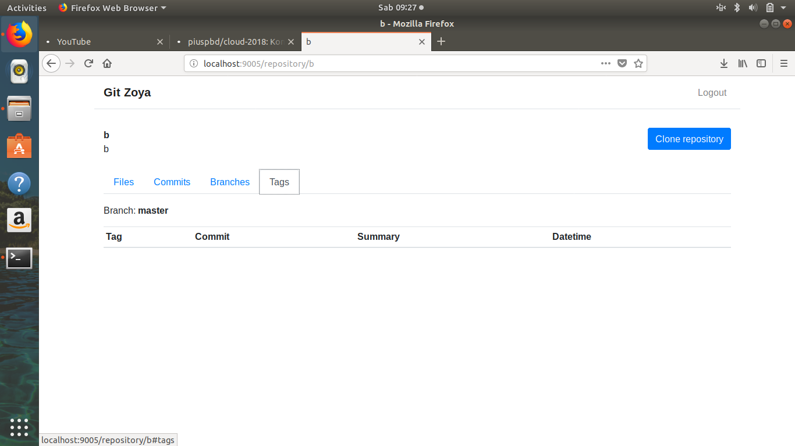

# LAPORAN Akhir FP CLOUD

## Penerapan Cloud untuk Perinangan Website "Git-Zoya"

### Anggota Kelompok :

  1. Aulia Teaku Nururrahmah - 05111540000012
  1. Pius Pambudi - 05111540000069
  1. Fatimatus Zulfa - 05111540000073
  1. R. Shidqi Tri P - 05111540000153

### Daftar Isi

  1. Pendahuluan
  1. Deskripsi Sistem
  1. Implementasi
  1. Hasil Akhir dan Cara Penggunaan Git-Zoya
  
### BAB 1. Pendahuluan

#### Latar Belakang

Website merupakan kumpulan halaman yang menampilkan informasi data teks, data gambar, data animasi, suara, video atan gabungan dari semuanya. Beragam website bermunculan dengan aneka corak dan ragamnya. Mulai dari website yang sederhana dengan hanya mengandalkan beberapa halaman statis HTML sampai website dinamis yang menggunakan teknik pengembangan yang kompleks. Proses pembuatan website bukan hal yang mudah. Kemajuan teknologi khususnya di bidang pengembangan website menyebabkan proses pembuatan website yang baik bukan lagi pekerjaan yang sulit. Dampak dari perkembangan website yang pesat mengakibatkan tidak semua pengembang website dapat mengikutinya dengan baik. 

Proyek mengerjakan website sangat beragam. Ada proyek yang dikerjakan secara individu, maupun proyek bersama. Ada proyek yang dikerjakan dalam jangka waktu pendek dan yang panjang hingga memerlukan waktu berbulan bulan bahkan bertahun-tahun. Proyek untuk membuat website tentu membutuhkan layanan host repository. Maka, Tom Werner pada 19 Oktober 2007 membangun sebuah layanan web hosting bersama yang disebut github dimana didalamnya terdapat fitur repository.

Terinspirasi dari layanan yang diberikan oleh github, kelompok kami ingin membuat sebuah layanan yang sejenis dengan github namun lebih sederhana dan memiliki fitur-fitur tambahan lainnya dalam rangka memenuhi tugas mata kuliah komputasi awan. Layanan ini kami beri nama “ Git-Zoya ”

#### Rumusan Masalah

Rumusan masalah dalam pengembangan sistem ini yaitu bagaimana membuat sebuah sistem yang mampu menyediakan layanan host repository layaknya github dan dapat menjalankan fungsionalitas tambahan lainnya yang akan dijelaskan di bab berikutnya.

#### Tujuan

Tujuan dari pembuatan Git-Zoya adalah mengembangkan sistem yang mempunyai kemampuan memberikan layanan host repository sehingga berguna dan bisa digunakan oleh para developer sistem yang ada di dunia ini.

### BAB 2. Deskripsi Sistem

Git-Zoya adalah layanan hosting git repository untuk proyek pengembangan perangkat lunak. Hal ini banyak digunakan untuk kode komputer. NAMA menawarkan paket repositori pribadi dan gratis dengan jumlah yang terhingga pada akun yang sama dan digunakan untuk proyek perangkat lunak. Secara rinci, FITUR Git-Zoya adalah sebagai berikut :

  1. Login dan Register
  1. Membuat repository
  1. Push dari repository lokal
  1. Fetch/pull/clone repository
  1. Menampilkan file di dalam repository
  1. Menampilkan commit history repository
  1. Membuat branch baru
  
#### Arsitektur Sistem

Spesifikasi :

  - Load Balancer :
    - Nginx
    - 1 core
    - Memory 1 GB
    - 1 Buah
  - Worker :
    - 1 core
    - 3 buah
  - Database :
    - MySQL
    - 1 core
    - 1 Buah
 
 #### Teknologi yang digunakan
 
  - Nginx sebagai load balancer
  - Apache sebagai worker
  - Python sebagai bahasa pemrograman backend
  - Flask sebagai microframework backend
  - MySQL sebagai database

#### Aspek Komputasi Awan

1. On demand Sef service

Maksud dari On-Demand Self-Service pengguna cloud dapat mengatur sendiri layanan yang dipakai sesuai dengan kebutuhannya tanpa interaksi dari pihak penyedia layanan. Contohnya menggunakan gmail, kita bisa menyimpan, memindahkan, menghapus email, dan sebagainya tanpa campur tangan dari penyedia cloud. Maka dalam hal ini, pada Git-Zoya p engguna dapat membuat repositori baru.

2. Broad Network Access

Akses jaringan yang luas dan bisa diakses oleh berbagai jenis perangkat, seperti smartphone , tablet, laptop, dsb. Contohnya facebook mobile, memungkinkan kita untuk mengakses layanan facebook melalui handphone, smartphone ataupun tablet dimanapun kita berada. Maka, Git-Zoya d apat diakses melalui browser Google Chrome, Mozilla Firefox, maupun Safari, baik via laptop maupun tablet tetapi masih menggunakan browser.

3. Resource Polling

Sumber daya komputasi dari penyedia cloud harus memenuhi banyak pelanggan dan bersifat dinamis tergantung kebutuhan pelanggannya. Contohnya google, menyediakan ratusan ribu server yang tersebar di penjuru dunia sehingga dapat melayani jutaan penggunanya. Maka, Server yang dimiliki Git-Zoya m emiliki storage yang besar sehingga dapat mencukupi kebutuhan storage pengguna.

4. Rapid Elasticity

Kapasitas layanan bersifat fleksibel tergantung kebutuhan pengguna. Sehingga pengguna cloud dapat dengan mudah meminta menaikkan atau menurunkan kapasitas layanan sesuai kebutuhannya. Jadi, kapasitas layanan ini seolah tak terbatas dan pengguna cloud dapat memilih sesuai dengan kebutuhannya setiap saat. Misalnya office 365, kita bisa dengan cepat mengubah layanan yang diinginkan dari small ke bussiness atau sebaliknya sesuai denngan kebutuhan. Sehingga, Pengguna dapat menambahkan kapasitas storage dengan membayar billing (pricing) yang sudah disediakan oleh Git-Zoya.

5. Measured Service

Sistem cloud menyediakan layanan yang dapat memonitor dan mengoptimalkan penggunaan sumber daya terhadap layanan yang dipakai (misalnya tempat penyimpanan, pemrosesan, bandwidth , dan akun pengguna yang aktif). Sehingga pelanggan dapat memonitor sumber daya komputasi yang dipakai secara transparan antara penyedia layanan dan pelanggan. Misalnya dropbox, kita bisa memantau space yang terpakai ataupun space yang masih kosong, mengetahui masa aktif akun, dsb. Sehingga pada Git-Zoya pengguna dapat melihat storage space yang tersedia untuk digunakan, dan dapat mengetahui storage yang tersisa yang dapat digunakan oleh pengguna.

#### Deskripsi Antar Muka

Layanan dapat diakses dari web maupun command line interface menggunakan REST API.

### BAB 3. Implementasi

Membuat Dockerfile seperti dibawah ini

    FROM ubuntu:16.04

    RUN apt-get update
    RUN apt-get install -y python3
    RUN apt-get install -y python3-pip
    RUN apt-get install -y libmysqlclient-dev
    RUN apt-get install -y git
    RUN pip3 install --upgrade pip

    COPY zoya zoya/

    RUN pip3 install -r zoya/requirements.txt

    ENV FLASK_APP=zoya/zoya.py
    ENV FLASK_ENV=development
    ENV GIT_PYTHON_REFRESH=quiet
    ENV LC_ALL=C.UTF-8
    ENV LANG=C.UTF-8
    CMD ["flask", "run", "--host=0.0.0.0", "--port=80"]

    EXPOSE 80

Berhubung kita membuat 3 buah worker, maka buat direktor WORKER1, WORKER2, WORKER3. Tambahkan Dockerfile ke dalam masing-masing worker. Letakkan folder Web pada masing-masing worker juga.

Sebelum membuat file docker-compose.yml, buat terlebih dahulu file default.conf

      upstream worker {
        ip_hash;
              server worker1;
              server worker2;
              server worker3;
      }

      server {
              listen 80;
              location / {
                      proxy_pass http://worker;
                      proxy_set_header Host $http_host;
              }
      }

Kami menggunakan algoritma IP_HASH.

Buat file docker-compose.yml

    version: '3.3'

    services:
        db:
            image: mysql:5.7
            volumes:
                - dbdata_fp:/var/lib/mysql
                - ./schema2.sql:/docker-entrypoint-initdb.d/1.sql
            restart: always
            environment:
                MYSQL_ROOT_PASSWORD: 123
                MYSQL_DATABASE: zoya
                MYSQL_USER: ikiuser
                MYSQL_PASSWORD: 123
                MYSQL_ROOT_HOST: '%'
        worker1:
            depends_on:
                - db
            build:
                context: worker1/
            volumes:
                - ./repositories:/var/zoya
            environment:
                DB_HOST: db
                DB_NAME: zoya
                DB_USERNAME: ikiuser
                DB_PASSWORD: 123
                REPO_DIR: /var/zoya
        worker2:
            depends_on:
                - db
            build:
                context: worker1/
            volumes:
                - ./repositories:/var/zoya
            environment:
                DB_HOST: db
                DB_NAME: zoya
                DB_USERNAME: ikiuser
                DB_PASSWORD: 123
                REPO_DIR: /var/zoya
        worker3:
            depends_on:
                - db
            build:
                context: worker1/
            volumes:
                - ./repositories:/var/zoya
            environment:
                DB_HOST: db
                DB_NAME: zoya
                DB_USERNAME: ikiuser
                DB_PASSWORD: 123
                REPO_DIR: /var/zoya
        balancer:
            image: nginx
            ports:
                - "9005:80"
            volumes:
                - ./default1.conf:/etc/nginx/conf.d/default.conf
            links:
                - worker1:worker1
                - worker2:worker2
                - worker3:worker3
    volumes:
        dbdata_fp:
        
Build file docker-compose.yml
  
    docker-compose up -d --build

Hingga muncul seperti pada gambar dibawah ini (muncul tulisan done atau up-to-date bila sebelumnya telah dijalankan):

    docker ps

untuk memeriksa image container yang aktif

Maka website telah dapat diakses pada http://localhost:9005

### BAB 4. Hasil Akhir dan Cara Penggunaan Git-Zoya

Git-Zoya memiliki tampilan akhir seperti berikut :

1. Apabila User belum memiliki akun di Git-Zoya, maka lakukan register terlebih dahulu

2. Bila telah memiliki akun, silahkan ke laman login, dan login dengan email address dan password yang  telah didaftarkan sebelumnya

3. Ketika berhasil masuk kedalam halaman awal Git Zoya, akan terdapat beberapa bagian seperti gambar berikut :

4. Untuk membuat New Repository, Pilih Button Create dan akan muncul kotak, isi kolom isian seperti dibawah.

Untuk judul dan deskripsi, diisi sesuai keinginan.

5. Maka, user akan otomatis masuk kedalam repo yang baru dibuat.

6. Ketika ingin me-clone repo, klik button Clone Repository lalu copy url seperti pada gambar dibawah ini. Tekan done bila selesai.

7. Gunakan Command Line, 
    
        git clone [url]

8. Setelah terclone ke local, maka lanjutkan dengan mencoba push file baru melalu CLI dengan cara berikut :

        touch file    //untuk membuat file baru
        git add All   //untuk menambahkan file yang telah dibuat
        git commit -m "Initial Commit"  //mengcommit
        git push  //push kedalam repo

9. Maka ketika halaman repo kita refresh, akan muncul file yang baru saja kita tambahkan. Tandanya Push telah berhasil dilakukan.

10. Selain itu, Git Zoya juda bisa menampilkan commit, Branch, dan Tags

User bisa klik Logout setelah selesai melakukan semua proses.

### Website bisa di download di 

  https://github.com/piuspbd/zoya

### Berikut file pendukungnya :

  1. [Dockerfile](assets/Dockerfile)
  1. [docker-compose.yml](assets/docker-compose.yml)
  1. [default.conf](assets/default1.conf)
